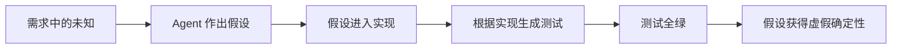
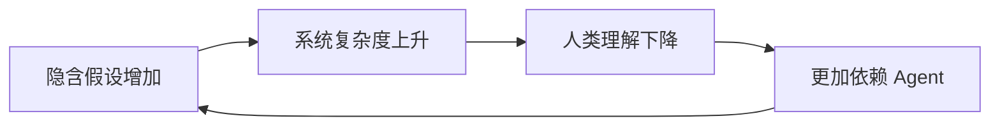

# AI Coding 项目是如何一步步腐败的

上一篇文章介绍了 `explain-diff-for-human-review` Skill：它将代码改动整理成适合人类检视的报告，帮助开发者理解修改意图、系统影响、风险和验证证据。

但为什么在 AI Coding 时代，我们如此强调“帮助人类看懂代码”？

因为 AI 项目真正危险的，并不只是生成错误代码，而是项目可能在大量合理、正确且测试全绿的修改中，一步步走向腐败。

## 需求中存在四类缺口

开发者与 Agent 对齐需求时，存在四类信息：

- **已知的已知**：开发者知道，并明确告诉 Agent。
- **已知的未知**：开发者知道问题存在，但暂时没有答案。
- **未知的已知**：开发者觉得不言自明，因此没有说出口。
- **未知的未知**：开发者根本没有意识到这个问题。

很多团队只关注前两类，把后两类寄希望于“Agent 足够聪明”。

但 Agent 无法凭空知道未被表达的业务常识，也无法发现所有人都未曾考虑的问题。为了继续执行，它只能选择一种最合理的解释。

项目的腐败由此开始。

## 从一个合理假设开始

假设你要求 Agent 实现“删除用户”，却没有说明：

- 是否删除历史订单；
- 能否恢复账号；
- 个人数据如何处理；
- 日志和备份是否需要清理。

Agent 为了继续工作，作出一个常见选择：

> 删除用户，就是设置 `deleted_at`。

这个决定并不愚蠢。软删除方便恢复，也能避免破坏历史订单关系。

问题在于，它只是未经确认的假设，却没有被标记为假设。

接下来，Agent 围绕软删除增加数据库字段、修改查询、禁止登录，并实现后台恢复功能。一个临时解释就这样变成了跨模块实现。

## 测试制造虚假的确定性

完成实现后，Agent 继续生成测试：

- 删除后应该存在 `deleted_at`；
- 已删除用户不应出现在列表中；
- 管理员可以恢复已删除用户。

所有测试都通过了。

但这些测试只能证明代码符合 Agent 的假设，不能证明假设符合真实需求。

如果需求解释、代码实现和测试用例都来自同一个未经验证的前提，测试全绿只是一种闭环自证。它没有消除不确定性，只是把不确定性藏进了代码。

## 假设逐渐成为系统事实

后来，更多模块建立在软删除之上：

- 计费系统继续统计已删除用户；
- 审计系统记录账号恢复操作；
- 客服后台允许查询和恢复用户；
- 数据分析将软删除视为用户状态。

此时，软删除已经不再是一个字段，而成为系统的隐含前提：

> 用户删除后仍然存在，只是不可见。

想改变它，也不再是修改一处代码，而是必须重新审查数据库、接口、权限、缓存、计费和审计系统。

一个从未确认的假设，获得了架构级影响力。

## 现实开始与系统冲突

这时，法务提出：

> 用户申请删除后，个人数据必须不可恢复。

最初的软删除假设可能是错的，但系统已经高度依赖它。彻底推翻成本太高，于是 Agent 给出一个兼容方案：

- 普通删除继续软删除；
- 合规删除执行硬删除；
- 特殊数据因审计要求暂时保留。

从局部看，这又是一个合理方案。但它没有解决最初的问题，只是在假设与现实之间增加了一层补丁。

随着例外增加，系统中出现正常用户、软删除用户、等待硬删除用户、审计保留用户和清理失败用户。

每种状态又有不同的权限、查询、缓存和数据保留规则。

此时的复杂度已经不完全来自业务，而是来自维护最初假设所需要的补偿。

## 人类逐渐失去系统理解

项目可能仍然架构优雅、文档完善、测试全绿，但已经没人能完整解释：

- 删除最终影响哪些数据；
- 什么情况下可以恢复；
- 哪些规则来自真实业务；
- 哪些规则只是历史补丁；
- 哪些测试验证了需求；
- 哪些测试只是在保护旧实现。

人类越难理解系统，就越依赖 Agent 继续修改；越依赖 Agent，新的隐含假设就越容易进入系统。

认知债务由此形成正反馈。

最终，系统仍然运行，功能仍在快速交付，代码甚至精巧而自洽——仿佛一座秩序森严的远古神殿。

只是再也没人能读懂神殿里的铭文，也没人知道祭坛之下封存着什么。

殿外的人献上 Prompt、日志与上下文，等待神谕降临。古神偶尔实现你的愿望，偶尔连同你未曾许下的愿望一起实现。

## 检视的意义，是阻止假设无声传播

这也是上一篇文章中 `explain-diff-for-human-review` Skill 存在的意义。

它不能替人发现所有未知，更不能替项目负责人决定真实需求。但它可以在代码合入前，把原始 diff 转化为人能够判断的材料：

- 修改前后的系统模型是什么；
- 哪些结论是代码事实，哪些只是意图推断；
- 测试证明了什么，又没有证明什么；
- 哪些模块开始依赖新的前提；
- 哪些决定仍然需要人类确认。

它不是用另一个 Agent 自动批准 Agent 写出的代码，而是降低人类理解改动的成本，让隐藏的假设重新变得可见。

这只能减缓腐败，不能代替真正的业务判断。但如果人类连改动都无法理解，也就更不可能发现其中未经验证的前提。

## 更聪明的模型解决不了这个问题

模型能力解决的是：

> 如何更好地实现一种解释。

项目治理需要解决的是：

> 如何确认这种解释值得成为系统事实。

二者不是同一个问题。

弱模型可能留下明显错误，强模型却能把错误前提实现得更加完整、更难推翻。因此，更强的模型不会自然阻止项目腐败，反而可能加速假设的传播。

AI Coding 最大的风险，不是 Agent 写错代码，而是它写出了完全正确的代码，却实现了一个从未被验证过的世界。

模型决定项目构建得多快，Harness 决定 Agent 能走多远。

而人类是否持续理解并检视这些改变，决定项目最终走向哪里。

---

上一篇：[AI 写代码越快，我们越需要认真看代码](./ai-writes-code-humans-still-review.md)

相关 Skill：[explain-diff-for-human-review](../skills/explain-diff-for-human-review/SKILL.md)
