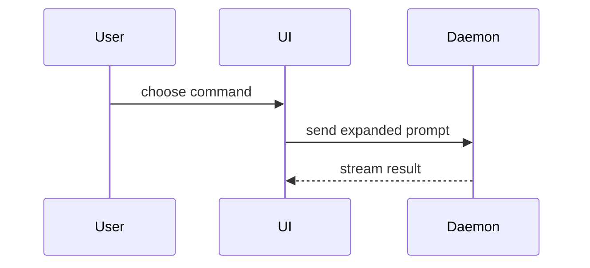

# 视觉表达约定

选择能回答当前 Review 问题的最小视图。每个视图只保留必要的调用、文件、状态和边界；不要为了“可视化”而画图。

## 逻辑变化：伪代码

```diff
 on(save)
-  write content
+  if content is unchanged
+    return cached result
+  write content
+  invalidate cache
```

## 运行时路径：调用树

```diff
 submitForm
   createSession
     persistPrompt
+    expandSkillMention
     launchAgent
-  navigateToSession
+  navigateToSession
+    subscribeToEvents
```

## UI 归属：组件树

```diff
 <SessionPage> (apps/example/src/routes/session.tsx)
   useSessionEvents()
   <SessionToolbar>
+    <RunSkillButton /> (packages/ui)
   <SessionTimeline>
+    <SkillResultCard />
```

## 职责变化：浅层文件树

```diff
 src/
 ├── commands/
+│   └── show-me.ts       # expands the slash command
 ├── sessions/
-└── transport.ts
+└── transport/
+    ├── client.ts        # request ownership
+    └── stream.ts        # event streaming
```

## 多方交互：流程或时序图

仅在参与者、顺序或失败路径本身是理解难点时使用 Mermaid：



## 数据和契约

数据库、API 或关键类型发生变化时，直接展示 reviewer 需要核对的字段、关系和输入输出。省略未变化且不影响理解的字段。

```diff
 POST /sessions
 {
   "prompt": string,
+  "skill": string | null
 }
```

## 选择原则

- 已有形状中的局部变化用 `diff`。
- 大部分是新内容，或者 `diff` 会隐藏所有权和执行顺序时，展示完整目标形状。
- 通常使用一到三个视图；一个视图能说清楚时不要增加第二个。
- 图旁边写明它表示代码事实、对代码的简化模型，还是尚待确认的方案。
- 不要展示无法从代码确认的“理想架构”，也不要把文件列表伪装成架构图。
